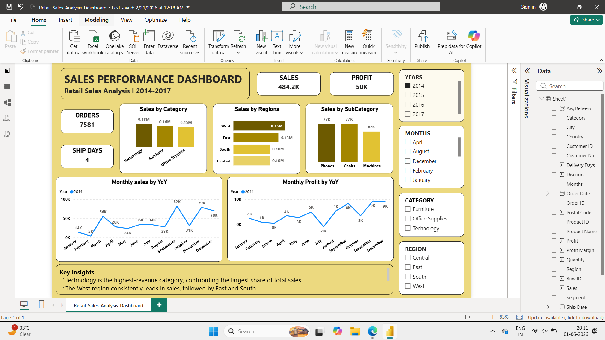

# Task-2-Data_Visualization-
A comprehensive Retail Sales Dashboard analyzing sales, profit, orders, and shipping performance across categories, sub-categories, regions, and time (2014–2017). This dashboard provides business insights into revenue distribution, profitability trends, and regional performance to support data-driven decision-making.

## Project Overview
The Retail Sales Performance Dashboard is an interactive analytics solution designed to:
1. Monitor total sales and profit
2. Analyze category and sub-category performance
3. Compare regional sales contribution
4. Track monthly Year-over-Year (YoY) sales and profit trends
5. Identify key business insights
6. The dashboard covers retail transaction data from 2014 to 2017.

## Objectives
1. Identify top-performing product categories
2. Compare regional sales distribution
3. Analyze monthly sales and profit trends
4. Evaluate shipping efficiency
5. Provide executive-level KPIs for quick decision-making

## Key Metrics (KPIs)
1. Total Sales - 484.2K
2. Total Profit - 50K
3. Total Orders - 7,581
4. Average Ship Days - 4

## Dashboard
 

## Key Insights
1. Technology is the highest revenue-generating category.
2. The West region consistently leads in sales.
3. Sales peak in September and November.
4. Some months show reduced profitability despite strong sales.
5. Average shipping time is maintained at 4 days.

## Future Enhancements
1. Add customer segmentation analysis
2. Add forecasting (ARIMA / Prophet)
3. Add profit margin analysis
4. Deploy dashboard to cloud (Power BI Service / Tableau Server)
5. Build automated data pipeline

Author 
Pranali Prakash Ranjane- Data Analyst Internship 
